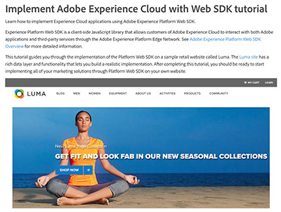

# Audience Manager チュートリアル

Audience Manager チュートリアルサイトへようこそ。 これらのチュートリアルを [ ドキュメント ](https://experienceleague.adobe.com/docs/audience-manager/user-guide/aam-home.html?lang=ja) と併用すると、Adobeのクラス最高の [!DNL data management platform] を使用して、Adobe Audience Managerを使用して任意のチャネルやデバイスでオーディエンスを作成し、アクティブ化する方法をより深く理解できます。

* お気に入りのコンテンツの一部を紹介する **スタッフのおすすめ**
* **左側のナビゲーション** でトピックおよびサブトピック別にコンテンツを探索
* 検索対象がわかっている場合は、ページ上部の **検索** フィールドを使用します。

## スタッフのおすすめ

<table>
<tr>
  <td>
    
    

      <a href="https://experienceleague.adobe.com/docs/platform-learn/implement-web-sdk/overview.html?lang=ja">
    <strong>Web SDKを使用したAdobe Experience Cloudの実装のチュートリアル </strong>
    </a>
    

    

    <em>Adobe Experience Platform Web SDKを使用してExperience Cloud アプリケーションを実装する方法について説明します </em>。
    

  </td>
  <td>
    
    

      <a href="https://experienceleague.adobe.com/docs/audience-manager-learn/tutorials/other-integrations/integrating-with-rtcdp/rtcdp-segments-for-aam-users.html?lang=ja">
    <strong>Audience Manager ユーザー向け Real-time CDP におけるセグメントについて </strong>
    </a>
    

    

    <em> このビデオでは、Audience Managerと Real-time CDP のセグメントおよびセグメント作成の違いについて説明します。</em>
    

  </td>
  <td>
    
    

      <a href="https://experienceleague.adobe.com/docs/audience-manager-learn/tutorials/build-and-manage-audiences/algorithmic-models/configure-and-report-on-predictive-audiences.html?lang=ja">
    <strong>Audience Managerでの Predictive Audiences の設定とレポート </strong>
    </a>
    

    

    <em> このビデオでは、Audience Manager インターフェイスでの Predictive Audiences 設定について順を追って説明します。</em>
    

  </td>
</tr>
</table>

