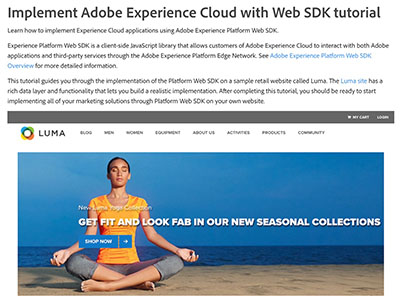
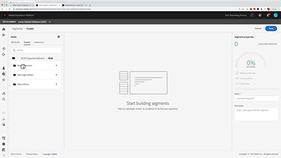
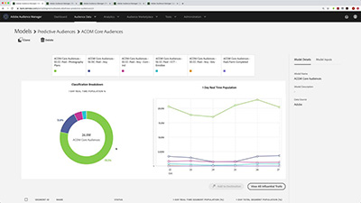

# Audience Manager チュートリアル

Audience Manager チュートリアルサイトへようこそ。 これらのチュートリアルと[&#x200B; ドキュメント &#x200B;](https://experienceleague.adobe.com/docs/audience-manager/user-guide/aam-home.html?lang=ja)を使用すると、Adobe Audience Managerを使用して、Adobeのクラス最高の[!DNL data management platform]を使用して、任意のチャネルまたはデバイスでオーディエンスを作成およびアクティブ化する方法をより深く理解できます。

* **スタッフのおすすめ**&#x200B;では、お気に入りのコンテンツをいくつか紹介しています
* **左側のナビゲーション**&#x200B;で、トピックとサブトピックごとにコンテンツを検索します
* お探しのものが分かっている場合は、ページ上部の&#x200B;**検索** フィールドを使用してください

## スタッフのおすすめ

<table>
<tr>
  <td>
    
    

      <a href="https://experienceleague.adobe.com/docs/platform-learn/implement-web-sdk/overview.html?lang=ja">
    <strong>Web SDKでのAdobe Experience Cloudの実装チュートリアル </strong>
    </a>
    

    

    <em>Adobe Experience Platform Web SDKを使用してExperience Cloud アプリケーションを実装する方法について説明します。</em>
    

  </td>
  <td>
    
    

      <a href="https://experienceleague.adobe.com/docs/audience-manager-learn/tutorials/other-integrations/integrating-with-rtcdp/rtcdp-segments-for-aam-users.html">
    <strong>Audience Manager ユーザー向けのReal-Time CDPのセグメントについて</strong>
    </a>
    

    

    <em>このビデオでは、Audience ManagerとReal-Time CDPのセグメントとセグメント作成の違いについて説明します。</em>
    

  </td>
  <td>
    
    

      <a href="https://experienceleague.adobe.com/docs/audience-manager-learn/tutorials/build-and-manage-audiences/algorithmic-models/configure-and-report-on-predictive-audiences.html">
    <strong>Audience Managerでの予測オーディエンスの設定とレポート </strong>
    </a>
    

    

    <em>このビデオでは、Audience Manager インターフェイスの予測オーディエンス設定について説明します。</em>
    

  </td>
</tr>
</table>

