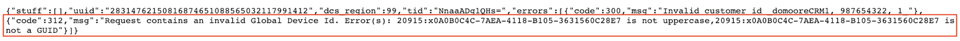
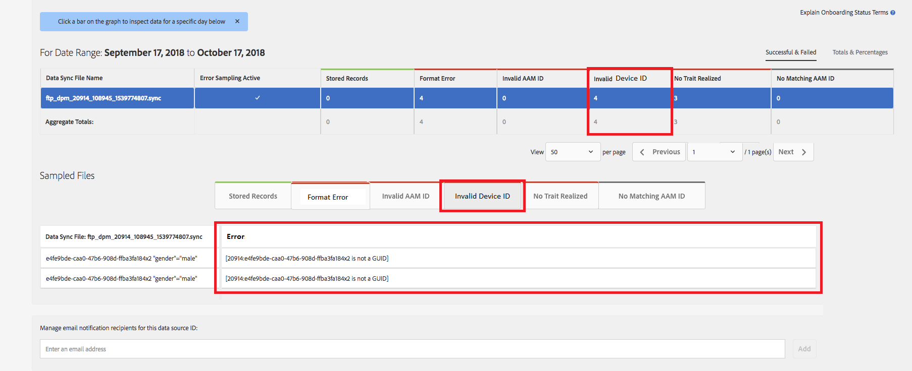

# グローバルデバイス IDの検証 {#global-device-id-validation}

デバイス Advertising ID （iDFA、GAID、Roku ID）には、デジタル広告エコシステムで使用するために満たす必要があるフォーマット標準があります。 現在、お客様やパートナーは、IDが適切にフォーマットされているかどうかの通知を受けることなく、任意のフォーマットでIDをアドビのグローバルデータソースにアップロードできます。 この機能を使用すると、グローバル データ ソースに送信されるデバイス IDの検証が適切な形式で行われ、IDが誤って形式に設定されている場合にエラーメッセージが表示されます。 起動時に[!DNL iDFA]、[!DNL Google Advertising]および[!DNL Roku IDs]の検証をサポートします。

## フォーマット標準の概要 {#overview-of-format-standards}

以下は、現在AAMで認識され、サポートされているグローバルなDevice Advertising ID プールです。 これらは共有[!UICONTROL Data Sources]として実装され、これらのプラットフォームのユーザーに関連付けられたデータを使用する任意のお客様またはデータパートナーが使用できます。

<table>
  <tr>
   <td>プラットフォーム </td>
   <td>AAM Data Source ID </td>
   <td>ID形式 </td>
   <td>AAM PID </td>
   <td>メモ </td>
  </tr>
  <tr>
   <td>Google Android（GAID）</td>
   <td>20914</td>
   <td>32の16進数。通常、8-4-4-4-12<em>と表示されます。例：97987bca-ae59-4c7d-94ba-ee4f19ab8c21  </em> </td>
   <td>1352</td>
   <td>このIDは、未加工/ハッシュ化/変更されていないフォーム参照 – <a href="https://play.google.com/about/monetization-ads/ads/ad-id/">https://play.google.com/about/monetization-ads/ads/ad-id/</a>で収集する必要があります</td>
  </tr>
  <tr>
   <td>Apple iOS （IDFA）</td>
   <td>20915</td>
   <td>32の16進数（通常は8-4-4-4-12 <em>例、6D92078A-8246-4BA4-AE5B-76104861E7DC  </em>） </td>
   <td>3560</td>
   <td>このIDは、未加工/ハッシュ化/変更されていないフォーム参照 – <a href="https://support.apple.com/en-us/HT205223">https://support.apple.com/en-us/HT205223</a>で収集する必要があります</td>
  </tr>
  <tr>
   <td>六（RIDA）</td>
   <td>121963</td>
   <td>32の16進数（通常、8-4-4-4-12 <em>例、</em> <em>fcb2a29c-315a-5e6b-bcfd-d889ba19aada</em>）</td>
   <td>11536</td>
   <td>このIDは、未加工/ハッシュ化/変更されていないフォーム参照 – <a href="https://sdkdocs.roku.com/display/sdkdoc/Roku+Advertising+Framework">https://sdkdocs.roku.com/display/sdkdoc/Roku+Advertising+Framework</a>で収集する必要があります </td>
  </tr>
  <tr>
   <td>Microsoft Advertising ID （MAID）</td>
   <td>389146</td>
   <td>Alpha数値文字列</td>
   <td>14593</td>
   <td>このIDは、未加工/ハッシュ化/変更されていないフォーム参照 – <a href="https://docs.microsoft.com/en-us/uwp/api/windows.system.userprofile.advertisingmanager.advertisingid">https://docs.microsoft.com/en-us/uwp/api/windows.system.userprofile.advertisingmanager.advertisingid</a> <a href="https://msdn.microsoft.com/en-us/library/windows/apps/windows.system.userprofile.advertisingmanager.advertisingid.aspx">https://msdn.microsoft.com/en-us/library/windows/apps/windows.system.userprofile.advertisingmanager.advertisingid.aspx</a>で収集する必要があります</td>
  </tr>
  <tr>
   <td>Samsung DUID</td>
   <td>404660</td>
   <td>Alpha数値文字列の例、7XCBNROQJQPYW</td>
   <td>15950</td>
   <td>このIDは、未加工/ハッシュ化/変更されていないフォーム参照 – <a href="https://developer.samsung.com/tv/develop/api-references/samsung-product-api-references/productinfo-api">https://developer.samsung.com/tv/develop/api-references/samsung-product-api-references/productinfo-api</a>で収集する必要があります </td>
  </tr>
</table>

## アプリでのAdvertising IDの設定 {#setting-an-advertising-identifier-in-the-app}

アプリで広告主IDを設定するには、まず広告主IDを取得し、次にExperience Cloudに送信する2つの手順を実行します。 これらの手順を実行するためのリンクを以下に示します。

1. IDの取得
   1. [!DNL advertising ID]に関する[!DNL Apple]情報が[ここ](https://developer.apple.com/documentation/adsupport/asidentifiermanager)にあります。
   1. [!DNL Android]開発者の[!DNL advertiser ID]の設定に関する情報の一部は、[ここ](http://android.cn-mirrors.com/google/play-services/id.html)にあります。
1. SDKの[!DNL setAdvertisingIdentifier] メソッドを使用してExperience Cloudに送信します
   1. `setAdvertisingIdentifier`を使用するための情報は、[!DNL iOS]と[!DNL Android]の両方の[&#x200B; ドキュメント &#x200B;](https://aep-sdks.gitbook.io/docs/using-mobile-extensions/mobile-core/identity/identity-api-reference#set-an-advertising-identifier)に記載されています。

`// iOS (Swift) example for using setAdvertisingIdentifier:`
`ACPCore.setAdvertisingIdentifier([AdvertisingId]) // ...where [AdvertisingId] is replaced by the actual advertising ID`

## 誤ったIDに対するDCS エラーメッセージ  {#dcs-error-messaging-for-incorrect-ids}

誤ったグローバルデバイス ID （IDFA、GAIDなど）がリアルタイムでAudience Managerに送信されると、ヒット時にエラーコードが返されます。 次に、IDが[!DNL Apple IDFA]として送信され、大文字のみを含める必要がありますが、IDに小文字の「x」が含まれているため、返されるエラーの例を示します。

エラーコードの一覧については、[&#x200B; ドキュメント &#x200B;](https://experienceleague.adobe.com/docs/audience-manager/user-guide/api-and-sdk-code/dcs/dcs-api-reference/dcs-error-codes.html?lang=ja#api-and-sdk-code)を参照してください。

## グローバルデバイス IDのオンボーディング {#onboarding-global-device-ids}

グローバルデバイス IDのリアルタイム送信に加えて、IDに対して「[!DNL onboard]」（アップロード）データを送信することもできます。 このプロセスは、お客様ID （通常はキーと値のペアを介して）に対してデータをオンボーディングする場合と同じですが、適切なData Source IDを使用するだけで、データがグローバルデバイス IDに割り当てられます。 オンボーディングプロセスに関するドキュメントについては、[&#x200B; ドキュメント &#x200B;](https://experienceleague.adobe.com/docs/audience-manager/user-guide/implementation-integration-guides/sending-audience-data/batch-data-transfer-process/batch-data-transfer-overview.html?lang=ja#implementation-integration-guides)を参照してください。 使用しているプラットフォームに応じて、グローバルデータソース IDを使用することを忘れないでください。

オンボーディングプロセスを通じて誤ったグローバルデバイス IDが送信された場合、エラーは[[!DNL Onboarding Status Report]](https://experienceleague.adobe.com/docs/audience-manager/user-guide/reporting/onboarding-status-report.html?lang=ja#reporting)に表示されます。

次に、そのレポートに表示されるエラーの例を示します。

