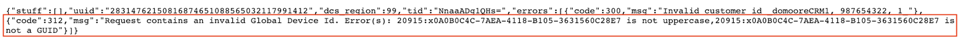

# グローバルデバイス ID の検証 {#global-device-id-validation}

デバイスAdvertisingの ID （iDFA、GAID、Roku ID など）には、デジタル広告エコシステムで使用できるようにするために満たす必要があるフォーマット基準があります。 現在、お客様およびパートナーは、ID が適切に形式されているかどうかの通知を受け取ることなく、任意の形式で ID をグローバルデータソースにアップロードできます。 この機能は、適切な形式でグローバル データ ソースに送信されたデバイス ID の検証を導入し、ID の形式が正しくない場合にエラーメッセージを表示します。 ローンチ時の [!DNL iDFA]、[!DNL Google Advertising] および [!DNL Roku IDs] の検証をサポートします。

## 形式標準の概要 {#overview-of-format-standards}

現在AAMで認識およびサポートされているグローバルデバイスAdvertising ID プールを以下に示します。 これらは、これらのプラットフォームのユーザーに関連付けられたデータを使用する、任意の顧客またはデータパートナーが使用できる共有 [!UICONTROL Data Sources] として実装されます。

<table>
  <tr>
   <td>プラットフォーム </td>
   <td>AAM Data Source ID </td>
   <td>ID 形式 </td>
   <td>AAM PID </td>
   <td>メモ </td>
  </tr>
  <tr>
   <td>GoogleAndroid（GAID）</td>
   <td>20914</td>
   <td>16 進数 32 個。通常、8-4-4-4-12<em> 例：97987bca-ae59-4c7d-94ba-ee4f19ab8c21  として表示 </em> </td>
   <td>1352</td>
   <td>この ID は、未加工/ハッシュ化されていない/変更されていないフォーム参照で収集する必要があります – <a href="https://play.google.com/about/monetization-ads/ads/ad-id/">https://play.google.com/about/monetization-ads/ads/ad-id/</a></td>
  </tr>
  <tr>
   <td>AppleiOS（IDFA）</td>
   <td>20915</td>
   <td>16 進数 32 個。通常、8-4-4-4-12 として表示 <em> 例：6D92078A-8246-4BA4-AE5B-76104861E7DC  </em> </td>
   <td>3560</td>
   <td>この ID は、未加工/ハッシュ化されていない/変更されていないフォーム参照で収集する必要があります – <a href="https://support.apple.com/en-us/HT205223">https://support.apple.com/en-us/HT205223</a></td>
  </tr>
  <tr>
   <td>Roku （RIDA）</td>
   <td>121963</td>
   <td>16 進数 32 個。通常、8-4-4-4-12 として表示 <em> 例：</em> <em>fcb2a29c-315a-5e6b-bcfd-d889ba19aada</em></td>
   <td>11536</td>
   <td>この ID は、未加工/ハッシュ化されていない/変更されていないフォーム参照で収集する必要があります – <a href="https://sdkdocs.roku.com/display/sdkdoc/Roku+Advertising+Framework">https://sdkdocs.roku.com/display/sdkdoc/Roku+Advertising+Framework</a> </td>
  </tr>
  <tr>
   <td>Microsoft Advertising ID （MAID）</td>
   <td>389146</td>
   <td>Alpha数値文字列</td>
   <td>14593</td>
   <td>この ID は、生の/ハッシュ化されていない/変更されていないフォーム参照で収集する必要があります – <a href="https://docs.microsoft.com/en-us/uwp/api/windows.system.userprofile.advertisingmanager.advertisingid">https://docs.microsoft.com/en-us/uwp/api/windows.system.userprofile.advertisingmanager.advertisingid</a> <a href="https://msdn.microsoft.com/en-us/library/windows/apps/windows.system.userprofile.advertisingmanager.advertisingid.aspx">https://msdn.microsoft.com/en-us/library/windows/apps/windows.system.userprofile.advertisingmanager.advertisingid.aspx</a></td>
  </tr>
  <tr>
   <td>Samsung DUID</td>
   <td>404660</td>
   <td>Alpha数値文字列の例，7XCBNROQJQPYW</td>
   <td>15950</td>
   <td>この ID は、未加工/ハッシュ化されていない/変更されていないフォーム参照で収集する必要があります – <a href="https://developer.samsung.com/tv/develop/api-references/samsung-product-api-references/productinfo-api">https://developer.samsung.com/tv/develop/api-references/samsung-product-api-references/productinfo-api</a> </td>
  </tr>
</table>

## アプリでのAdvertising ID の設定 {#setting-an-advertising-identifier-in-the-app}

アプリで広告主 ID を設定するには、実際には 2 つの手順があります。最初に広告主 ID を取得し、次にExperience Cloudに送信します。 これらの手順を実行するためのリンクを以下に示します。

1. ID の取得
   1. [!DNL Apple] に関する [!DNL advertising ID] しい情報は、[ こちら ](https://developer.apple.com/documentation/adsupport/asidentifiermanager) をご覧ください。
   1. [!DNL advertiser ID] 開発者向けの [!DNL Android] の設定に関する情報は、[ こちら ](http://android.cn-mirrors.com/google/play-services/id.html) を参照してください。
1. SDKの [!DNL setAdvertisingIdentifier] メソッドを使用して、Experience Cloudに送信します
   1. `setAdvertisingIdentifier` の使用に関する情報は、[ と ](https://aep-sdks.gitbook.io/docs/using-mobile-extensions/mobile-core/identity/identity-api-reference#set-an-advertising-identifier) の両方について [!DNL iOS] ドキュメント [!DNL Android] に記載されています。

`// iOS (Swift) example for using setAdvertisingIdentifier:`
`ACPCore.setAdvertisingIdentifier([AdvertisingId]) // ...where [AdvertisingId] is replaced by the actual advertising ID`

## 間違った ID に対する DCS エラーメッセージ  {#dcs-error-messaging-for-incorrect-ids}

誤ったグローバルデバイス ID （IDFA、GAID など）がリアルタイムでAudience Managerに送信されると、ヒットでエラーコードが返されます。 次に示すエラーの例は、ID が [!DNL Apple IDFA] として送信され、大文字のみを含める必要があるが、ID に小文字「x」が含まれているためです。

エラーコードのリストについては、[ ドキュメント ](https://experienceleague.adobe.com/docs/audience-manager/user-guide/api-and-sdk-code/dcs/dcs-api-reference/dcs-error-codes.html?lang=en#api-and-sdk-code) を参照してください。

## オンボーディンググローバルデバイス ID {#onboarding-global-device-ids}

グローバルデバイス ID をリアルタイムで送信する以外に、ID に対してデータを「アップロー [!DNL onboard]」（アップロード）することもできます。 このプロセスは、顧客 ID に対してデータをオンボーディングする場合と同じです（通常はキーと値のペアを使用）。ただし、適切な Data Source ID を使用するだけで、データがグローバルデバイス ID に割り当てられます。 オンボーディングプロセスに関するドキュメントは、[ ドキュメント ](https://experienceleague.adobe.com/docs/audience-manager/user-guide/implementation-integration-guides/sending-audience-data/batch-data-transfer-process/batch-data-transfer-overview.html?lang=en#implementation-integration-guides) を参照してください。 使用しているプラットフォームに応じて、グローバルデータソース ID を使用することを忘れないでください。

オンボーディングプロセスを通じて間違ったグローバルデバイス ID が送信された場合、[[!DNL Onboarding Status Report]](https://experienceleague.adobe.com/docs/audience-manager/user-guide/reporting/onboarding-status-report.html?lang=en#reporting) にエラーが表示されます。

このレポートを通じて発生するエラーの例を次に示します。

