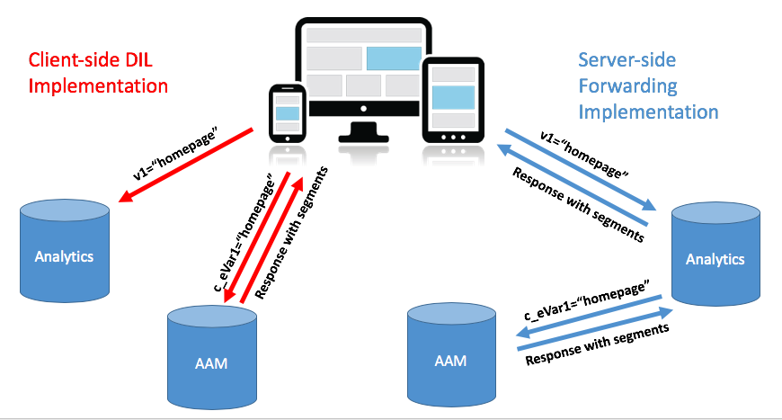
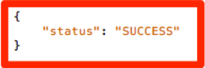

# クライアントサイドのDILからサーバーサイドの転送にサイトのAudience Manager実装を移行する {#migrating-your-site-s-aam-implementation-from-client-side-dil-to-server-side-forwarding}

このチュートリアルは、Adobe Audience Manager（AAM）とAdobe Analyticsの両方を使用しており、現在DIL（[!DNL Data Integration Library]）コードを使用してページからAAMにヒットを送り、ページからAdobe Analyticsにヒットを送っている場合に適用されます。 これらのソリューションは両方ともAdobe Experience Cloudに含まれているため、サーバーサイド転送を有効にするベストプラクティスに従って、[!DNL Analytics] データ収集サーバーがクライアント側のコードでページからAAMにヒットを送信するのではなく、サイト分析データをリアルタイムでAudience Managerに転送できるようにします。 このチュートリアルでは、従来のクライアントサイド DILの実装から新しいサーバーサイド転送方式への切り替えを行う手順について説明します。

## クライアントサイド（DIL）とサーバーサイド {#client-side-dil-vs-server-side}

Adobe Analytics データをAAMに取り込む2つの方法を比較して比較する場合、まず次の画像の違いを視覚化すると便利です。

### クライアントサイドのDIL実装 {#client-side-dil-implementation}

この方法を使用してAdobe Analytics データをAAMに取り込むと、Web ページから2つのヒットが得られます。1つは[!DNL Analytics]に行き、1つはWeb ページに[!DNL Analytics] データをコピーした後にAAMに行きます。 [!UICONTROL Segments]はAAMからページに返され、パーソナライゼーションなどに使用できます。 これはレガシー実装と見なされ、もはや推奨されません。

これがベストプラクティスに従っていないという事実を除いて、この方法を使用する欠点は次のとおりです。

* ページからのヒット数が1回ではなく2回である
* AAM オーディエンスを[!DNL Analytics]にリアルタイムで共有するには、サーバーサイド転送が必要です。そのため、クライアントサイドの実装では、この機能（および将来的には他の機能）を使用できません

AAMを実装するサーバーサイド転送方式に移行することをお勧めします。

### サーバーサイド転送の実装 {#server-side-forwarding-implementation}

上の画像に示すように、ヒットはWeb ページからAdobe Analyticsに送信されます。 [!DNL Analytics]はそのデータをリアルタイムでAAMに転送し、訪問者はヒットがページから直接来たかのように、AAM特性と[!UICONTROL segments]に評価されます。

[!UICONTROL Segments]は、パーソナライゼーション用にWeb ページに応答を転送する[!DNL Analytics]に対して同じリアルタイム ヒットで返されます。

サーバーサイド転送に移行するタイミングにダウンサイドはありません。 Adobeでは、Audience Managerと[!DNL Analytics]の両方を持つユーザーがこの実装方法を使用することを強くお勧めします。

## 主に2つのタスクがあります {#you-have-two-main-tasks}

このページにはかなりの情報があり、それはもちろん重要です。 ただし、**すべて、次の2つの主要な操作に限定されます。**

1. コードをクライアントサイドのDIL コードからサーバーサイドの転送コードに変更する
1. [!DNL Analytics] [!DNL Admin Console]のスイッチを反転して、データの実際の転送を開始します（[!UICONTROL report suite]あたり）

これらのタスクのいずれかをスキップすると、サーバーサイド転送は正しく機能しません。 このドキュメントには、設定に適した手順と追加データが追加されています。この2つの手順を正しく実行できます。

## 実装オプション {#implementation-options}

クライアントサイドからサーバーサイド転送に移行する際に、必要となるタスクの1つは、コードを新しいサーバーサイド転送コードに変更することです。 これは、次のいずれかのオプションを使用して行います。

* Adobe Experience Platform タグ - Adobeで推奨されるWeb プロパティの実装オプション。 Platformのタグがあらゆる作業を肩代わりしてくれるので、これは簡単な作業です。
* Adobe Launchを使用していない場合は、新しいSSF コードを`appMeasurement.js` ファイル内の`doPlugins`関数に直接配置することもできます
* 他のタグマネージャー – これらは、他のタグマネージャーが[!DNL AppMeasurement] コードを保存している場所に`doPlugins`にSSF コードを配置するので、前の（ページ上の）オプションと同じように扱うことができます

以下の各項目については、_コードの更新_ セクションで説明します。

## 実装ステップ {#implementation-steps}

次の手順では、実装について説明します。

### 手順0：前提条件：Experience Cloud ID サービス（ECID） {#step-prerequisite-experience-cloud-id-service-ecid}

サーバーサイド転送に移行するための主な前提条件は、Experience Cloud ID サービスを実装することです。 これは、Experience Platform Launchを使用している場合に最も簡単に実行できます。この場合、ECID拡張機能をインストールするだけで、残りの作業を行うことができます。

Adobe以外のTMSを使用している場合、またはTMSをまったく使用していない場合は、ECIDを実装して&#x200B;**before**&#x200B;他のAdobe ソリューションを実行してください。 詳しくは、[ECID ドキュメント ](https://experienceleague.adobe.com/docs/id-service/using/home.html?lang=ja)を参照してください。 他の前提条件はコードバージョンだけなので、次の手順でコードの最新バージョンを適用するだけで問題ありません。

>[!NOTE]
>
>実装する前に、このドキュメント全体をお読みください。 以下の「タイミング」セクションには、ECIDを含め、各部分を実装する必要がある&#x200B;*時期*&#x200B;に関する重要な情報があります（まだ実装されていない場合）。

### 手順1：現在使用しているオプションをDIL コードから記録する {#step-record-currently-used-options-from-dil-code}

クライアントサイドのDIL コードからサーバーサイド転送に移行する準備が整ったら、最初の手順は、カスタム設定やAAMに送信されるデータなど、DIL コードで実行しているすべてを識別することです。 注目および検討すべき事項は、次のとおりです。

* 通常の[!DNL Analytics]変数、`siteCatalyst.init` DIL モジュールを使用 – ジョブは通常の[!DNL Analytics]変数を送信するだけであり、これはサーバーサイド転送を有効にすることで発生するため、この変数について心配する必要はありません。
* パートナーサブドメイン - `DIL.create`関数で、`partner` パラメーターをメモします。 これは「パートナーサブドメイン」または場合によっては「パートナーID」と呼ばれ、新しいサーバーサイド転送コードを配置する際に必要になります。
* [!DNL Visitor Service Namespace] - 「[!DNL Org ID]」または「[!DNL IMS Org ID]」とも呼ばれ、新しいサーバーサイド転送コードを設定する際にも同様に必要になります。 メモしておきます。
* containerNSID、uuidCookie、その他の高度なオプション – サーバー側転送コードでも設定できるように、使用している追加の高度なオプションをメモしておきます。
* その他のページ変数 – ページから他の変数がAAMに送信されている場合（siteCatalyst.initで処理される通常の[!DNL Analytics]変数に加えて）、サーバーサイド転送を介して送信できるように他の変数をメモする必要があります（spoiler alert: via [!DNL contextData] variables）。

### 手順2：コードの更新 {#step-updating-the-code}

[実装オプション ](#implementation-options) （上記）では、サーバーサイド転送を実装する方法と場所に関して、複数のオプションが指定されています。 このセクションを効果的に使用するには、これらのセクションに分割する必要があります（そのうちの2つを組み合わせて）。 この節の方法で、ニーズに最もよく当てはまるものを選択してください。

#### Adobe Experience Platform tags {#launch-by-adobe}

Adobe Experience Platform Launchで、クライアントサイドのDILコードからサーバーサイドの転送に実装オプションを移行する方法については、次の動画をご覧ください。

>[!VIDEO](https://video.tv.adobe.com/v/26310/?quality=12)

#### 「ページ上」またはAdobe以外のタグマネージャー {#on-the-page-or-non-adobe-tag-manager}

以下のビデオでは、ファイルまたはAdobe以外のTMSに格納されている、クライアントサイドのDIL コードから[!DNL AppMeasurement] コードのサーバーサイド転送に実装オプションを移行する方法について説明します。

>[!VIDEO](https://video.tv.adobe.com/v/26312/?quality=12)

### 手順3：転送を有効にする（単位：[!UICONTROL Report Suite]） {#step-enabling-the-forwarding-per-report-suite}

これまで、このチュートリアルでは、クライアントサイドのDIL コードからサーバーサイドの転送へのコードの切り替えに時間をかけてきました。 それは難しい部分なので、それはそれでいいのです。 このセクションは、非常に簡単ですが、コードを更新するのと同じくらい重要です。 このビデオでは、AnalyticsからAudience Managerへのデータの実際の転送を可能にするスイッチを反転する方法を説明します。

>[!VIDEO](https://video.tv.adobe.com/v/26355/?quality-12)

**メモ：**&#x200B;動画に記載されているように、転送の有効化がExperience Cloud バックエンドで完全に実装されるまでに最大4時間かかることを覚えておいてください。

## タイミング {#timing}

注意として、クライアントサイド DILからサーバーサイド転送に移行する場合は、主に2つのタスクがあります。

1. コードの更新
1. [!DNL Analytics] [!DNL Admin Console]のスイッチを反転しています

先ほどの質問ですが、どちらを使用しますか？ それは重要なことですか。 OK、ごめんなさい、2つの質問でした。 しかし、答えは…それは異なります。はい、それは&#x200B;*can*&#x200B;問題です。 どう思う？ ここでは、その目的と方法を解説します。 しかし、最初にあなたが多数のサイトを持つ大規模な組織であるならば、最初に出てくる可能性がある追加の質問：私は一度にすべてを行う必要がありますか？ こっちのほうが少し簡単です。 誰も。 断片的に作成できます。

### 掘り下げる {#a-little-deeper-dive}

タイミングと注文の問題が発生する理由は、_really_&#x200B;の転送の仕組みです。これは、以下のいくつかの技術的な事実にまとめることができます。

* Experience Cloud ID サービス （ECID）を実装しており、[!DNL Analytics] [!DNL Admin Console]のスイッチ （「スイッチ」）がオンになっている場合、コードをまだ更新していなくても、データは[!DNL Analytics]からAAMに転送されます。
* ECIDが実装されていない場合、スイッチがオンになっていて、サーバーサイドの転送コードがある場合でも、データは転送されません。
* サーバー側の転送コード（Platform タグ内でもページ上でも）は実際に応答を処理し、移行を完了するために必要です。
* サーバー側転送スイッチは[!UICONTROL report suite]によって有効になっていますが、コードはPlatform タグのプロパティによって、またはPlatform タグを使用しない場合は[!DNL AppMeasurement] ファイルによって処理されます。

### ベストプラクティス {#best-practices}

これらの技術的な詳細に基づいて、何をすべきか、いつ実行すべきかのタイミングに関する推奨事項は次のとおりです。

#### ECIDがまだ実装されていない場合 {#if-you-do-not-have-ecid-yet-implemented}

1. サーバーサイド転送で有効にする[!UICONTROL report suite]ごとに[!DNL Analytics]のスイッチを反転します。

   1. ECIDがないため、転送はまだ開始されません。

1. サイトごとに、クライアントサイド DILからサーバーサイド転送（これはPlatform タグに含まれる場合があります）またはページ上でコードを更新します（上記の別のセクションで説明します）。

   1. （ECIDを追加したので）転送が開始され、ビーコン [!DNL Analytics]に対する適切なJSON応答も受け取る必要があります（詳細については、以下の「検証とトラブルシューティング」の節を参照してください）。

#### ECIDが実装されている場合 {#if-you-do-have-ecid-implemented}

1. DILからサーバーサイド転送を有効にする[!UICONTROL report suite]ごとのサーバーサイド転送にコードを更新する準備が整うように準備して計画します。

   1. [!DNL Analytics]のスイッチを反転して、サーバーサイド転送を有効にします。

      1. ECIDが有効になっているため、転送が開始されます。

   1. できるだけ早く、クライアントサイドのDILからシングルサイド転送にコードを更新します（これはPlatform タグまたはページ上で行うことができます。前述の別の節で説明します）。

      1. [!DNL Analytics] ビーコンに対して適切なJSON応答が返されます（詳細については、以下の[検証とトラブルシューティング ](#validation-and-troubleshooting)の節を参照）。

>[!NOTE]
>
>上記の手順1と2の間では、AAMに取り込まれるデータが重複するため、これらの2つの手順を可能な限り近づけることが重要です。 つまり、シングルサイド転送は[!DNL Analytics]からAAMへのデータ送信を開始し、DIL コードがまだページ上にあるので、ページからAAMに直接移動するヒットも発生し、データが倍増します。 DILからサーバーサイド転送にコードを更新するとすぐに、これは軽減されます。

>[!NOTE]
>
>データの小さな複製ではなく、データの小さな相違を希望する場合は、上記の手順1と2の順序を切り替えることができます。 コードをDILからサーバーサイド転送に移行すると、スイッチを反転して[!UICONTROL report suite]のサーバーサイド転送を有効にできるようになるまで、AAMへのデータフローが停止されます。 通常、顧客は、訪問者を特性や[!UICONTROL segments]に誘導するのを見逃すのではなく、データの小さな倍増を好みます。

#### 多数のサイトと[!UICONTROL report suites]がある場合の移行タイミング {#migration-timing-when-you-have-many-sites-and-report-suites}

このトピックについては、前の節で簡単に触れました。主な戦略は次のようにまとめることができます。

一度に1つのサイト/[!UICONTROL report suite] （またはサイトのグループ/[!UICONTROL report suites]）を移行します。

ただし、次のようなシナリオによっては、予測が難しい場合があります。

* 複数の異なる[!UICONTROL report suites]を含むサイトがあります
* 複数のサイトを含む[!UICONTROL report suite]があります（グローバル [!UICONTROL report suite]など）
* 複数のサイトをカバーするには、1つのPlatform タグプロパティを使用します
* サイトごとに異なる開発チームがあり

カスタムオブジェクトを使用すると、複雑になる可能性があります。 私が提案できる最良のことは次のとおりです。

* 上記の説明に基づいて、サーバーサイド転送に移行するための戦略を策定するには、時間がかかります
* Platform タグ内の単一のプロパティ（または単一の[!DNL AppMeasurement] ファイル）が通常1または2個の個別の[!UICONTROL report suites]にマッピングされるという事実に基づいて、エンタープライズをサーバーサイド転送に更新して、これらの個別のグループで機能するプランを作成できる可能性があります
* Adobe Consultingを利用している場合は、必要に応じてサポートを受けられるように、移行計画について連絡を取ります

## 検証とトラブルシューティング {#validation-and-troubleshooting}

サーバーサイド転送が起動して実行中であることを検証する主な方法は、アプリから発生したAdobe Analytics ヒットに対するレスポンスを確認することです。

[!DNL Analytics]からAudience Managerへのデータのサーバーサイド転送を行っていない場合、[!DNL Analytics] ビーコンに対する応答は実際には存在しません（2x2 ピクセルを除く）。 ただし、サーバーサイド転送を行っている場合、[!DNL Analytics]のリクエストとレスポンスで確認できる項目があります。この項目を使用すると、[!DNL Analytics]がAudience Managerと正しく通信し、ヒットを転送し、レスポンスを取得していることを知ることができます。

>[!VIDEO](https://video.tv.adobe.com/v/26359/?quality=12)

>[!WARNING]
>
>偽りの“成功”に注意しましょう。 応答があり、すべてが機能しているように見える場合は、応答に`stuff` オブジェクトがあることを確認してください。 正しく表示されない場合は、`"status":"SUCCESS"`というメッセージが表示される可能性があります。 これは非常にクレイジーに聞こえますが、実際には正しく機能していないことを証明しています。
>
>これが表示される場合は、Platform タグまたは[!DNL AppMeasurement]でコードの更新が完了したことを意味しますが、[!DNL Analytics] [!DNL Admin Console]での転送はまだ完了していません。 この場合、[!UICONTROL report suite]の[!DNL Analytics] [!DNL Admin Console]でサーバーサイド転送を有効にしていることを確認する必要があります。 まだ4時間も経っていない場合は、バックエンドで必要な変更をすべて行うのにそれほど時間がかかることがあるため、しばらくお待ちください。

サーバーサイド転送について詳しくは、[ ドキュメント ](https://experienceleague.adobe.com/docs/analytics/admin/admin-tools/server-side-forwarding/ssf.html?lang=ja)を参照してください。
