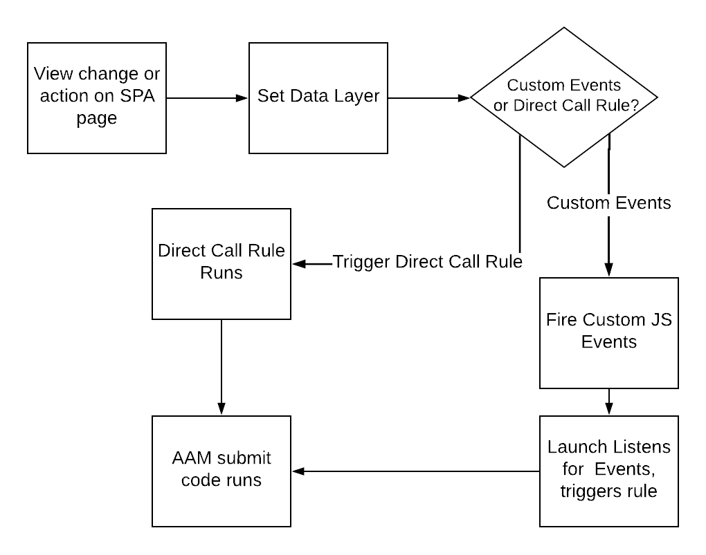

# AAMにデータを送信する際のSPA ページに関するベストプラクティスを使用する {#using-best-practices-on-spa-pages-when-sending-data-to-aam}

このドキュメントでは、シングルページアプリケーション（SPA）からAdobe Audience Manager（AAM）にデータを送信するためのベストプラクティスについて説明します。 この記事では、推奨される実装方法である[!UICONTROL Experience Platform tags]の使用に焦点を当てます。

## 初期メモ

* 以下の項目は、Platform タグを使用してサイトに実装することを前提としています。 Platform タグを使用していないが、実装方法に合わせて適応させる必要がある場合は、引き続き考慮事項が存在します。
* SPAはそれぞれ異なるため、要件に合わせて次の項目を調整する必要があるかもしれません。Adobeでは、SPA ページからAudience Managerにデータを送信する際に、考える必要があるベストプラクティスをいくつか紹介します。

## Experience Platform タグ（旧Adobe Cloud Platform Launch）でのSPAとAAMの操作を示すシンプルな図{#simple-diagram-of-working-with-spas-and-aam-in-experience-platform-launch}

タグ内のaamの

>[!NOTE]
>前述したように、これは、Platform タグを使用して（Adobe Analyticsを使用しない）Adobe Audience Manager実装でSPA ページを処理する方法を簡略化した図です。 ご覧のとおり、これは非常に簡単で、大きな決定は、ビューの変更（またはアクション）をPlatform タグに伝える方法です。

## SPA ページからのタグのトリガー {#triggering-launch-from-the-spa-page}

Platform タグでルールをトリガーする（つまりAudience Managerにデータを送信する）一般的な方法は、次の2つです。

* JavaScript カスタムイベントの設定（Adobe Analyticsを使用した例[HERE](https://helpx.adobe.com/analytics/kt/using/spa-analytics-best-practices-feature-video-use.html)を参照）
* [!UICONTROL Direct Call Rule]の使用

このAudience Managerの例では、Platform タグで[!UICONTROL Direct Call rule]を使用して、Audience Managerに入るヒットをトリガーします。 次のセクションで説明しているように、[!UICONTROL Data Layer]を新しい値に設定することで、Platform タグの[!UICONTROL Data Element]が取得できるようになります。

## デモページ {#demo-page}

ここでは、SPA ページで行う場合と同様に、データレイヤーの値を変更してAudience Managerに送信する方法を示す小さなページを示します。 この機能は、より手の込んだ変更が必要なようにモデル化することができます。 このデモページは[ここ](https://aam.enablementadobe.com/SPA-Launch.html)にあります。

## データレイヤーの設定 {#setting-the-data-layer}

前述したように、Platform タグがデータレイヤーから新しい値を取得してAudience Managerにプッシュできるように、新しいコンテンツがページに読み込まれたり、サイト上で誰かがアクションを実行したりすると、データレイヤーをページの先頭で動的に設定して[!UICONTROL rules]を実行する必要があります。

上記のデモサイトに移動し、ページソースを見ると、次のような表示になります。

* データレイヤーは、Platform タグの呼び出しの前のページの先頭にあります
* シミュレートされたSPA リンク内のJavaScriptは[!UICONTROL Data Layer]を変更し、Platform タグ（`_satellite.track()`呼び出し）を呼び出します。 この[!UICONTROL Direct Call Rule]の代わりにJavaScript カスタムイベントを使用していた場合、レッスンは同じです。 最初に[!DNL data layer]を変更し、次にPlatform タグを呼び出します。

>[!VIDEO](https://video.tv.adobe.com/v/38109/?captions=jpn&quality=12)

## その他のリソース {#additional-resources}

* [ADOBE フォーラムに関するSPA ディスカッション](https://forums.adobe.com/thread/2451022)
* [Platform タグにSPAを実装する方法を示すリファレンスアーキテクチャサイト](https://helpx.adobe.com/experience-manager/kt/integration/using/launch-reference-architecture-SPA-tutorial-implement.html)
* [Adobe AnalyticsでSPAをトラッキングする際のベストプラクティスの使用](https://helpx.adobe.com/analytics/kt/using/spa-analytics-best-practices-feature-video-use.html)
* [この記事に使用するデモサイト](https://aam.enablementadobe.com/SPA-Launch.html)
